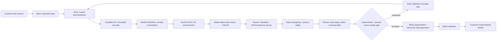
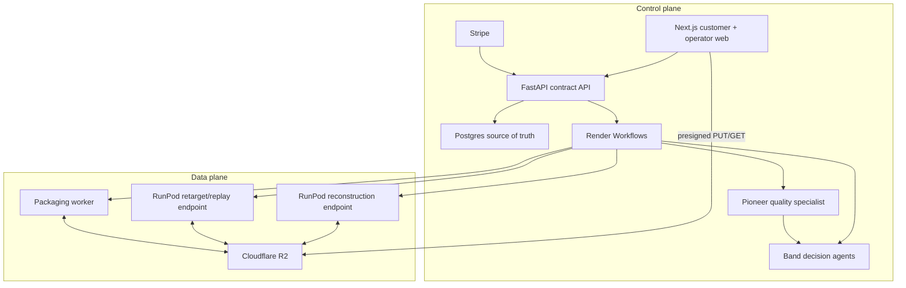
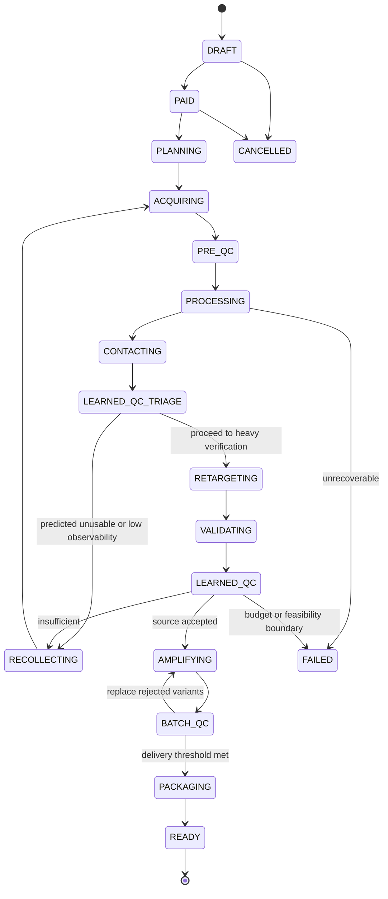

# FORGE 제품·기술 아키텍처 Handoff

> 상태: 실행 기준 문서
> 독자: FORGE를 처음 맡은 사람 또는 코딩 에이전트
> 관련 문서: [팀 역할과 실행 Handoff](./HANDOFF_TEAM_OWNERSHIP.md), [UI 디자인 시스템 Handoff](./HANDOFF_UI_DESIGN_SYSTEM.md)

## 0. 이 문서의 권한과 사용법

이 문서는 FORGE가 **무엇을 판매하고**, **어떤 기술을 어디까지 사용하며**, **어떤 플랫폼이 어떤 책임을 갖고**, **어떤 품질 기준을 통과한 결과만 고객에게 전달하는지**를 고정하는 단일 기준 문서다.

새 에이전트는 다음 원칙을 지킨다.

1. 구현 전에 이 문서와 연결된 두 handoff를 끝까지 읽는다.
2. 문서에 없는 외부 서비스, 논문 기술, 데이터 포맷을 핵심 경로에 추가하지 않는다.
3. 논문의 주장을 구현 완료 사실처럼 쓰지 않는다. 공개 코드가 없는 기술은 `paper-derived reimplementation`으로 표시한다.
4. 실제로 실행되지 않은 단계는 `passed`로 기록하지 않는다. fixture와 mock은 이름과 UI에서 모두 `simulated`로 표시한다.
5. 모든 산출물은 원본 physical-behavior source(사람 영상, robot state, teleop,
   simulation 또는 multimodal capture)까지 역추적할 수 있어야 한다.
6. 증폭은 단일 소스 demonstration이 물리 검증을 통과한 뒤에만 시작한다.
7. 계약과 상태 머신을 먼저 고정하고, GPU와 웹을 그 계약에 맞춰 독립적으로 개발한다.

## 1. 한 문장 정의

FORGE는 고객의 로봇 task 요구를 받아 Terac 또는 고객 시스템에서 목적에 맞는
physical-behavior source를 수집하고, RunPod GPU에서 이를 metric 4D
actor-counterpart interaction과 embodiment-neutral `Canonical Skill IR`로 복원한 뒤,
접촉 일관성·robot retargeting·motion-specific physics replay를 통과한 source만
증폭하여 **고객 소유의 학습 가능한 로봇 데이터셋**으로 납품하는 데이터 제조 회사다.

### 2026-08-15 전역 로봇 scope 규칙

이 규칙이 이 문서 아래의 과거 manipulation 예시보다 우선한다. FORGE core는 손,
사람, dexterous manipulation에 한정되지 않는다. source actor는 human, robot, mixed,
simulation 또는 unknown일 수 있고 observation은 video, robot state, teleop log,
simulation trace 또는 multimodal일 수 있다. motion family는 manipulation, bimanual,
tool use, locomotion, whole body, mobile manipulation, navigation, aerial, articulated
machine, multi-robot를 포함한다. `hand`, `MANO`, `object`라는 아래 설명은
manipulation profile의 구체 예일 뿐 공통 schema나 제품 전체의 제한이 아니다.

새 에이전트는 실제 구현 기준으로 `docs/JOONGHUI_COMPILER.md`와
`src/forge/modules/skill_ir/models.py`를 함께 읽는다. target robot별 simulator와
quality profile이 없는 motion family는 UI에서 production-ready로 표시하지 않는다.

핵심 흐름은 다음과 같다.



## 2. 제품 경계

### 2.1 FORGE가 판매하는 것

FORGE는 완성된 로봇 policy를 판매하는 회사가 아니라 **policy 학습 이전의 고품질 physical interaction data manufacturing service**를 판매한다. 고객 주문의 최소 계약은 아래 capability tuple이다.

```text
(S, E, N, C, Q, B)

S = Skill specification: 성공 조건, 실패 조건, 시작/종료 상태
E = Embodiment: 로봇, 손/그리퍼, URDF/MJCF, 관절 제한, 센서 좌표계
N = Volume: 원하는 validated episode 수
C = Coverage: 물체, 자세, 초기 위치, 배경, 수행자 분포
Q = Quality: contact, replay, coverage, export 기준
B = Budget boundary: 수집·GPU·검수의 허용 경계
```

첫 vertical은 다음 조건을 만족하는 rigid-object 조작으로 제한한다.

- 한 손 또는 단순 양손 동작으로 표현 가능하다.
- 물체가 심하게 변형되지 않는다.
- 정적 또는 거의 정적인 카메라에서 hand-object가 관측된다.
- 성공 조건을 시각·기하·상태 기반으로 정의할 수 있다.
- 고객 로봇의 URDF 또는 MJCF와 관절 제한을 확보할 수 있다.

추천 첫 showcase는 `bottle/cap open-close`다. 뚜껑과 병의 상대 자세, 접촉 시점, 완료 상태가 비교적 명확하고 동일 task의 viewpoint·grasp·object variation을 설명하기 쉽다.

### 2.2 고객이 받는 결과

한 주문의 delivery bundle은 다음을 포함한다.

```text
delivery/<order_id>/
├── README.md
├── manifest.json
├── LICENSE_AND_RIGHTS.json
├── dataset_card.md
├── raw_index.parquet
├── source_demonstrations/
│   ├── videos/
│   ├── camera/
│   ├── hands/
│   ├── objects/
│   ├── contacts/
│   └── skill_ir/
├── robot_trajectories/
│   ├── qpos/
│   ├── end_effector/
│   ├── gripper/
│   └── replay_reports/
├── generated_episodes/
├── quality/
│   ├── per_episode.parquet
│   ├── aggregate.json
│   ├── rejection_reasons.json
│   └── evidence/
├── provenance/
│   ├── graph.jsonl
│   ├── model_versions.json
│   └── artifact_checksums.sha256
└── exports/
    ├── lerobot/
    ├── rlds/
    └── customer_schema/
```

`manifest.json`은 고객이 받은 episode가 어떤 사람 영상, 어떤 모델/weight, 어떤 설정, 어떤 retargeting, 어떤 검증 결과에서 생성되었는지 연결하는 최종 권위 파일이다.

### 2.3 초기 비고객과 비목표

초기 핵심 경로에 다음을 넣지 않는다.

- deformable object, 천, rope, 음식 자체의 변형 모델링
- 유체의 정확한 물리 시뮬레이션
- 빠르게 움직이는 arbitrary dynamic camera
- tactile/force를 비디오만으로 ground truth라고 주장하는 기능
- 전체 방 또는 사람 전신의 정밀한 scene reconstruction
- C2Dex의 전체 residual PPO/ManipTrans 재현
- 공개되지 않은 VideoManip grasping/manipulation code가 존재한다고 가정한 통합
- 출처와 권리를 확인하지 않은 대규모 인터넷 영상 scraping
- 하나의 demo를 통과시키기 위해 여러 sponsor platform을 핵심 경로에 억지로 결합하는 것

## 3. 구매자, 비즈니스 모델, 가격 단위

### 3.1 구매자

- dexterous hand 또는 humanoid를 만드는 robotics startup
- VLA/robot foundation model 팀
- 특정 공정 automation을 준비하는 기업 연구 조직
- 실제 로봇 수집 비용이 높고 simulation gap에 민감한 연구실

### 3.2 구매 프로세스

1. 고객은 task, embodiment, volume, coverage, quality를 정의한다.
2. FORGE는 feasibility와 데이터 권리를 검토해 quote를 만든다.
3. hackathon/pilot에서는 Stripe Payment Link로 유료 주문을 증명한다.
4. 생산 계약에서는 accepted human source, validated robot episode, custom embodiment/export의 난이도를 분리해 견적한다.
5. 고객에게는 단순 영상 개수가 아니라 **검증된 robot-ready episode와 provenance**를 납품한다.

가격은 경쟁사 수치를 추정해 문서에 박지 않는다. 실제 인터뷰와 quote가 확보되기 전까지 아래의 내부 원가식으로만 계산한다.

```text
COGS = human_acquisition
     + recollection
     + gpu_reconstruction
     + gpu_retarget_and_replay
     + object_asset_and_model_api
     + storage_and_egress
     + human_exception_review

gross_margin = contract_value - COGS
```

핵심 경제 지표는 다음 둘이다.

- `human dollars / accepted source demonstration`
- `total dollars / validated robot episode`

고객 policy 결과를 측정할 수 있는 계약에서는 `policy improvement / dollar`를 최종 가치 지표로 추가한다.

### 3.3 차별점

1. **Canonical Skill IR**: 특정 robot joint가 아니라 object-centric contact와 phase로 skill을 표현한다.
2. **Active acquisition**: 실패한 영상을 버리는 데서 끝나지 않고 결손 viewpoint·grasp·object를 Band가 진단해 Terac에 재수집한다.
3. **Validate before amplify**: 하나의 잘못된 reconstruction을 대량 복제하지 않는다.
4. **Full lineage**: 원본, 모델, 설정, 파생 episode, 검증 evidence를 content hash로 연결한다.
5. **Customer ownership**: 계약에서 허용한 파생권과 사용권을 bundle에 명시하고 vendor lock-in 없는 표준 export를 제공한다.

## 4. 시스템 아키텍처

### 4.1 Control plane과 data plane

**Control plane**은 주문, 상태, 권리, 결제, orchestration, 의사결정, 지표를 관리한다. Render의 web/API/Postgres/Workflow와 Band가 이 영역이다.

**Data plane**은 대용량 영상과 GPU 산출물을 이동·계산한다. 브라우저는 presigned URL로 Cloudflare R2에 직접 업로드하고, RunPod worker도 R2에서 읽고 쓴다. Render API를 영상 프록시로 사용하지 않는다.



### 4.2 플랫폼 책임

| 플랫폼 | 필수 여부 | 책임 | 금지되는 사용 |
|---|---:|---|---|
| Terac | 핵심 | 작업자 모집, task 배포, submission/compensation, 실제 human data acquisition | raw 영상의 영구 source of truth로 취급하지 않음 |
| Render | 핵심 | Next.js, FastAPI, Postgres, durable workflow execution | GPU inference 또는 대용량 media proxy |
| Render Workflows | 핵심 | retry 가능한 pipeline DAG, fan-out/fan-in, 상태 전이 | incoming request server로 사용하지 않음 |
| Band | 핵심 | acquisition 계획, 품질 실패 해석, recollection decision, operator summary | 작업 실행기 또는 DB source of truth |
| Pioneer | 핵심 | 모든 capture/source의 learned usability·physics-pass 예측, 다음 촬영 지시 분류, 누적 label을 이용한 specialist model fine-tuning/evaluation/inference | deterministic physics/safety gate를 단독으로 대체하거나 raw PII 영상을 prompt로 전송 |
| Cloudflare R2 | 핵심 | immutable raw/artifact/delivery object storage, presigned upload | 상태 머신과 사업 데이터 저장 |
| RunPod | 핵심 | GPU container 실행, stage별 비동기 job | 제품 상태와 retry 정책의 권위자가 됨 |
| Stripe | 핵심 | pilot 결제, webhook 기반 payment state | 결제 상태를 redirect만으로 확정 |
| GitHub | 핵심 | 코드, schema, issue, review, immutable release tag | weight와 고객 원본 영상 저장 |
| Linq | 선택 | 특정 결손을 보완하는 전문가 재촬영 요청 | 일반 Terac 흐름이 준비되기 전 필수 의존성화 |
| Superserve | 선택 | 고객 custom transform/export sandbox | 신뢰하지 못한 코드를 core worker에서 실행 |
| Replay | 선택 | operator용 visual QA와 비교 replay | 수치 metric의 대체재 |

Render Workflows는 외부에서 직접 호출되는 네트워크 서버가 아니라 API가 시작시키고 외부 서비스로 outbound call을 수행하는 orchestration layer로 사용한다. scheduling이나 Blueprint 자동 관리가 제품의 전제 조건이 되면 안 된다.

### 4.3 목표 repository 구조

```text
FORGE/
├── apps/
│   └── web/                       # customer portal, capture, operator console
├── services/
│   ├── api/                       # FastAPI, auth, orders, signed URLs, webhooks
│   └── workflows/                 # Render Workflow DAG and activities
├── workers/
│   ├── reconstruction/            # VideoManip/Do-As-I-Do adapters
│   ├── contact/                   # FORGE stable-contact compiler
│   ├── retarget/                  # kinematic + physics path
│   ├── validate/                  # source/batch quality gates
│   └── package/                   # LeRobot/RLDS/customer export
├── packages/
│   ├── contracts/                 # JSON Schema/OpenAPI/generated clients
│   ├── skill-ir/                  # Canonical Skill IR types and validators
│   ├── quality-model/             # Pioneer feature/label/evaluation policy
│   ├── db/                        # migrations and repository layer
│   ├── ui/                        # tokens and accessible primitives
│   └── observability/             # events, metrics, error taxonomy
├── integrations/
│   ├── terac/
│   ├── band/
│   ├── pioneer/
│   ├── cloudflare/
│   ├── runpod/
│   ├── stripe/
│   └── linq/
├── infra/
│   ├── render/
│   └── runpod/
├── third_party/
│   ├── THIRD_PARTY_LOCK.json
│   └── LICENSE_LEDGER.md
├── tests/
│   ├── contracts/
│   ├── fixtures/
│   └── e2e/
├── docs/
└── HANDOFF_*.md
```

외부 논문 repository를 FORGE application source에 복사해 섞지 않는다. `workers/*/adapters`가 version-pinned container를 호출하도록 격리한다.

## 5. 권위 계약

계약의 실제 구현 위치는 `packages/contracts`다. 아래 예시는 최초 schema를 만들기 위한 규범이다. 필드를 바꾸려면 두 역할 담당자가 모두 승인하고 schema version을 올린다.

### 5.1 Order contract

```json
{
  "schema_version": "forge.order.v1",
  "order_id": "ord_...",
  "tenant_id": "ten_...",
  "skill": {
    "name": "open_and_close_bottle_cap",
    "initial_state": "cap fully seated",
    "success_predicate": "cap separates, then returns to seated pose",
    "failure_predicates": ["bottle falls", "cap leaves workspace"],
    "phases": ["approach", "grasp", "twist_open", "release", "regrasp", "twist_close"]
  },
  "embodiment": {
    "robot_id": "customer_robot_v1",
    "model_uri": "r2://.../robot.mjcf",
    "model_sha256": "...",
    "hand_type": "dexterous",
    "joint_limits_uri": "r2://.../joint_limits.json"
  },
  "volume": {"validated_episodes": 1000},
  "coverage": {
    "object_ids": ["bottle_a", "bottle_b"],
    "viewpoint_bins": ["front", "front_left", "front_right"],
    "grasp_variation": "required"
  },
  "quality": {
    "source_replay_pass_required": true,
    "max_penetration_m": 0.005,
    "min_contact_phase_f1": 0.8,
    "min_delivery_acceptance_rate": 0.9
  },
  "rights_profile": "customer_exclusive_derivatives"
}
```

임곗값은 예시 default일 뿐이다. 실제 물체 scale, simulator, robot에 맞춘 calibration 없이 marketing claim으로 사용하지 않는다.

### 5.2 Capture record

```json
{
  "schema_version": "forge.capture.v1",
  "capture_id": "cap_...",
  "order_id": "ord_...",
  "worker_subject_id": "sub_pseudonymous_...",
  "protocol_version": "bottle_v1",
  "video_uri": "r2://tenant/raw/cap_.../video.mp4",
  "sha256": "...",
  "mime_type": "video/mp4",
  "device": {"orientation": "landscape", "camera_facing": "rear"},
  "object_id": "bottle_a",
  "viewpoint_bin": "front_left",
  "consent_receipt_uri": "r2://tenant/private/consent/...json",
  "submitted_at": "RFC3339 timestamp",
  "declared_rights": ["process", "derive", "deliver_to_named_customer"]
}
```

### 5.3 GPU job request와 result

```json
{
  "schema_version": "forge.gpu-job.v1",
  "job_id": "job_...",
  "idempotency_key": "sha256(stage+input+config+image)",
  "stage": "reconstruction",
  "input_artifacts": [{"uri": "r2://...", "sha256": "..."}],
  "config_uri": "r2://.../config.json",
  "container": {"image": "ghcr.io/...@sha256:...", "pipeline_version": "..."},
  "output_prefix": "r2://tenant/artifacts/job_.../",
  "callback_token_ref": "secret-manager-reference",
  "attempt": 1
}
```

```json
{
  "schema_version": "forge.gpu-result.v1",
  "job_id": "job_...",
  "status": "succeeded",
  "artifacts": [{"kind": "object_pose", "uri": "r2://...", "sha256": "..."}],
  "metrics": {"frames_total": 180, "frames_valid": 172, "gpu_seconds": 0},
  "warnings": [],
  "model_versions_uri": "r2://.../model_versions.json",
  "error": null
}
```

`gpu_seconds: 0` 같은 값은 fixture에서만 허용하고 production result에는 worker가 측정한 값을 기록한다.

### 5.4 Band decision contract

Band는 자연어 조언만 남기지 않고 검증 가능한 decision을 반환한다.

```json
{
  "schema_version": "forge.decision.v1",
  "decision_id": "dec_...",
  "order_id": "ord_...",
  "decision_type": "RECOLLECT",
  "reason_codes": ["OBJECT_OCCLUDED_AT_CONTACT", "VIEWPOINT_COVERAGE_GAP"],
  "evidence_artifact_ids": ["art_...", "art_..."],
  "requested_captures": [{
    "object_id": "bottle_a",
    "viewpoint_bin": "front_right",
    "instruction_delta": "keep fingertips and cap edge visible during first twist",
    "count": 3,
    "worker_qualification": "general"
  }],
  "confidence": 0.86,
  "policy_version": "acquisition-policy-v1",
  "requires_human_approval": false
}
```

Band는 지표와 evidence URI만 읽는다. 개인 식별 영상 원본을 LLM prompt에 직접 넣지 않는다.

### 5.5 Pioneer quality verdict contract

Pioneer는 RunPod가 계산한 구조화 metric, capture 조건, deterministic gate 결과와 operator label을 사용해 specialist quality model을 학습·평가·서빙한다. 초기에는 Pioneer base/open-weight model을 사용하고, 실제 label이 축적되면 source lineage 단위로 train/validation을 분리해 fine-tune한다.

```json
{
  "schema_version": "forge.pioneer-verdict.v1",
  "verdict_id": "pvr_...",
  "subject_type": "source_demonstration",
  "subject_id": "demo_...",
  "inference_stage": "POST_REPLAY",
  "input_feature_version": "forge-qc-features-v1",
  "input_artifact_ids": ["art_metrics_..."],
  "model": {
    "provider": "pioneer",
    "project_id": "forge-quality",
    "model_id": "base-or-training-job-id",
    "model_version": "immutable-deployment-version"
  },
  "predictions": {
    "source_usable_probability": 0.74,
    "physics_pass_probability": 0.61,
    "recommended_action": "RECOLLECT_GENERAL",
    "reason_codes": ["OBJECT_OCCLUDED_AT_CONTACT"],
    "next_capture_instruction": "record from the front-right and keep the cap edge visible"
  },
  "calibration": {
    "evaluation_id": "pioneer-eval-id",
    "decision_threshold_version": "pioneer-threshold-v1"
  },
  "created_at": "RFC3339 timestamp"
}
```

규칙:

- Pioneer는 모든 production capture/source에 호출되는 핵심 stage다.
- hard constraint, collision, penetration, rights, checksum과 실제 physics replay 결과는 deterministic gate가 권위다.
- Pioneer verdict는 GPU 우선순위, operator review, Band recollection decision과 다음 촬영 지시에 필수 입력이다.
- Pioneer 장애 시 production workflow는 `LEARNED_QC_PENDING`에서 대기한다. 조용히 모델을 건너뛰지 않는다. 긴급 manual override는 actor·이유·model outage evidence를 남긴다.
- raw video, 얼굴, 작업자 PII를 Pioneer text inference에 전송하지 않는다. pseudonymous ID와 구조화 metric/label만 사용한다.
- fine-tuned model은 held-out evaluation에서 사전 합의한 precision, recall, calibration 기준을 통과해야 champion으로 승격된다.

### 5.6 Canonical Skill IR

Skill IR은 원본 카메라나 특정 robot joint에 종속되지 않는 object-centric representation이다.

```json
{
  "schema_version": "forge.skill-ir.v1",
  "skill_ir_id": "sir_...",
  "source_reconstruction_id": "rec_...",
  "canonical_object": {
    "asset_uri": "r2://.../object.glb",
    "asset_sha256": "...",
    "scale_m": [0.07, 0.07, 0.19],
    "canonical_frame": "object_mesh_v1"
  },
  "trajectory": {
    "timestamps_s": [0.0],
    "T_world_object": ["4x4 row-major matrices"],
    "T_object_wrist": ["4x4 row-major matrices"],
    "hand_configuration": ["MANO or normalized hand parameters"]
  },
  "phases": [{
    "name": "twist_open",
    "start_frame": 42,
    "end_frame": 103,
    "stable_contacts": [{
      "object_surface_point": [0.1, -0.2, 0.4],
      "object_surface_normal": [0.0, 0.9, 0.1],
      "hand_region": "right_thumb_distal",
      "support": 0.81
    }]
  }],
  "gravity_world": [0.0, 0.0, -1.0],
  "quality": {
    "contact_observability": 0.0,
    "temporal_pose_consistency": 0.0,
    "accepted": false,
    "reason_codes": []
  },
  "provenance_parent_ids": ["art_..."]
}
```

`object_surface_point`는 canonical object 좌표의 normalized surface coordinate 또는 vertex/barycentric reference로 구현한다. 단순 world-space fingertip 점을 canonical contact로 저장하지 않는다.

### 5.7 Delivery manifest

```json
{
  "schema_version": "forge.delivery.v1",
  "order_id": "ord_...",
  "delivery_id": "del_...",
  "dataset_version": "1.0.0",
  "rights_profile": "customer_exclusive_derivatives",
  "source_summary": {"submitted": 0, "accepted": 0, "rejected": 0},
  "episode_summary": {"generated": 0, "validated": 0, "delivered": 0},
  "quality_summary_uri": "r2://.../aggregate.json",
  "provenance_graph_uri": "r2://.../graph.jsonl",
  "model_versions_uri": "r2://.../model_versions.json",
  "checksums_uri": "r2://.../artifact_checksums.sha256",
  "exports": [],
  "known_limitations": [],
  "created_from_pipeline_release": "git-tag-or-sha"
}
```

## 6. 상태 머신과 불변 조건



불변 조건:

- DB 상태 변경과 event append는 하나의 transaction으로 처리한다.
- 동일 `idempotency_key`의 stage는 동일 artifact set을 돌려준다.
- retry가 새 source/episode로 집계되면 안 된다.
- 모든 artifact에는 `sha256`, schema version, producer version, parent artifact IDs가 있다.
- `AMPLIFYING` 전이는 `source_validation.accepted == true` 없이는 불가능하다.
- 모든 production source에는 versioned `pioneer-verdict`가 있어야 한다. 단, Pioneer는 deterministic hard fail을 pass로 바꿀 수 없다.
- `READY` 전이는 권리, checksum, quality, export validation이 모두 통과해야 한다.
- manual override는 actor, 이유, 전후 값, evidence를 append-only audit log에 남긴다.
- 상태를 역행시키지 않는다. 재작업은 새 attempt 또는 새 entity로 표현한다.

## 7. 데이터 모델

Postgres의 최소 entity는 다음과 같다.

| Entity | 역할 | 주요 unique 조건 |
|---|---|---|
| `tenants` | 고객 격리 | tenant slug |
| `dataset_orders` | 주문과 capability contract | order id, Stripe payment intent |
| `capture_batches` | acquisition/recollection 지시 | order + batch sequence |
| `demonstrations` | 사람 submission과 권리 | capture id, raw sha256 |
| `qc_runs` | 단계별 metric/reason | subject + stage + config hash |
| `qc_feature_sets` | Pioneer 입력용 비식별 구조화 feature | subject + feature version |
| `model_predictions` | Pioneer verdict와 model/evaluation lineage | subject + model version |
| `model_training_examples` | capture/physics/operator 결과에서 생성된 label | subject + label version |
| `model_registry` | Pioneer base/fine-tuned champion·challenger | provider + model/deployment version |
| `gpu_jobs` | async RunPod attempt | idempotency key + attempt |
| `artifacts` | R2 object metadata | tenant + sha256 + kind |
| `provenance_edges` | parent-child lineage | parent + child + relation |
| `reconstructions` | metric 4D 결과 | demo + pipeline version |
| `skill_irs` | canonical skill | reconstruction + compiler version |
| `robot_trajectories` | embodiment retarget | skill IR + robot + config hash |
| `episodes` | source/generated episode | episode id + version |
| `decisions` | Band output과 evidence | decision id |
| `webhook_events` | Stripe/Terac dedupe | provider + provider event id |
| `deliveries` | immutable customer release | order + semantic version |

R2 key는 tenant를 첫 prefix로 사용한다.

```text
tenants/<tenant_id>/
  private/consent/<subject_id>/<receipt_id>.json
  raw/<order_id>/<capture_id>/<sha256>.mp4
  artifacts/<order_id>/<stage>/<job_id>/<artifact>
  evidence/<order_id>/<qc_run_id>/<artifact>
  delivery/<order_id>/<delivery_id>/<artifact>
```

R2 URI를 DB primary key로 사용하지 않는다. DB artifact ID와 checksum이 권위이고 URI는 storage location이다.

## 8. End-to-end pipeline

### 8.1 주문과 acquisition plan

입력:

- customer skill contract
- target robot model과 사용 권리
- 수량·coverage·quality·budget 경계

Band의 `Dataset Architect`가 구조화된 plan을 만든다.

- task phase와 성공/실패 조건
- object/viewpoint/grasp matrix
- 작업자 qualification: general 또는 expert
- capture protocol version
- 초기 수집 개수와 stop/recollection 조건

Render Workflow가 plan을 검증한 후 Terac integration으로 campaign을 만든다. Band가 직접 Terac을 호출해 state를 변경하지 않는다.

### 8.2 촬영 protocol

첫 protocol의 필수 지시:

- 후면 카메라, 가로 화면, 고정된 촬영 위치를 기본으로 한다.
- 손 전체와 대상 물체가 시작부터 종료까지 화면 안에 있어야 한다.
- 접촉 부위가 손바닥이나 다른 물체에 완전히 가려지지 않도록 선택된 viewpoint를 지킨다.
- 동작 시작 전 물체를 명확히 보여주고, tracking anchor를 위해 첫 구간에 물체 표면을 천천히 가리키거나 지정 표식을 보여준다.
- 지정된 성공 동작을 자연스럽고 과도하게 빠르지 않게 한 번 수행한다.
- 편집, 속도 변경, 필터, portrait 회전 metadata 손실을 금지한다.
- 배경은 단순하게 하고 다른 유사 물체를 치운다.
- 사람 얼굴·주소·민감 정보가 나오지 않도록 한다.

브라우저 capture UI는 upload 완료 전에 다음을 검사한다.

- codec/container decode 가능 여부
- frame 수와 duration 범위
- 해상도와 orientation
- 심한 blur/black frame
- 손/대상 물체의 대략적인 가시성
- checksum 생성과 multipart upload 완료

### 8.3 Pre-QC

CPU 또는 저비용 inference에서 다음 reason code로 accept/reject한다.

```text
VIDEO_CORRUPT
DURATION_OUT_OF_RANGE
RESOLUTION_TOO_LOW
CAMERA_MOTION_EXCESSIVE
HAND_NOT_VISIBLE
OBJECT_NOT_VISIBLE
CONTACT_REGION_OCCLUDED
TASK_INCOMPLETE
WRONG_OBJECT
WRONG_VIEWPOINT
RIGHTS_MISSING
```

Pre-QC는 4D 성공을 예측하는 gate가 아니라 명백한 실패에 GPU를 쓰지 않는 gate다. 낮은 confidence는 reject가 아니라 GPU queue 또는 operator review로 보낸다.

### 8.4 Metric 4D reconstruction

출력 최소 조건:

- per-frame intrinsics
- gravity/camera alignment
- metric or scale-calibrated depth
- object mask와 mesh/geometry
- per-frame object SE(3)
- per-frame hand pose/shape
- tracking confidence와 invalid frame mask

각 좌표계는 명시적으로 이름을 갖고 transform convention을 schema에 고정한다. meter, radian, right-handed convention을 기본으로 하며 외부 repo adapter 경계에서만 변환한다.

### 8.5 Stable contact compilation

단순한 frame별 최근접 fingertip을 접촉이라고 하지 않는다. FORGE compiler는 C2Dex의 핵심 통찰을 적용한다.

1. 모든 접촉 후보를 canonical object 좌표로 변환한다.
2. hand-object proximity와 상대 속도가 안정된 local temporal segment를 찾는다.
3. object surface상의 후보를 clustering한다.
4. 지배 cluster와 medoid 또는 barycentric representative를 선택한다.
5. phase별 contact set, support, uncertainty를 Skill IR에 기록한다.
6. occlusion/pose drift가 큰 구간은 `low_observability`로 표시하고 무리하게 보간하지 않는다.

접촉 stage의 필수 metric:

- observed contact frames / expected contact frames
- canonical contact cluster support
- temporal contact jitter
- hand-object penetration proxy
- pose tracking continuity

### 8.6 Retargeting

두 경로를 제공한다.

**Fast path**

- wrist/object relative trajectory와 contact target을 target robot frame으로 매핑한다.
- joint limits, collision, velocity/acceleration regularization이 있는 kinematic IK를 푼다.
- capture 재수집 여부를 빠르게 판단하는 목적이다.

**Heavy path**

- MuJoCo/MuJoCo Warp에서 trajectory를 replay한다.
- sampling-based MPC 또는 trajectory optimization으로 contact와 object motion을 맞춘다.
- domain/random force perturbation을 적용해 brittle trajectory를 구분한다.
- 고객 delivery candidate를 만드는 경로다.

둘은 동일한 Skill IR과 `robot_trajectory.v1` 계약을 사용한다. heavy path가 실패했을 때 fast path 성공을 최종 physics pass로 승격하지 않는다.

### 8.7 Source validation

source demonstration은 다음 gate를 모두 통과해야 한다.

- 필수 phase와 phase 순서가 존재한다.
- contact observability가 주문 기준 이상이다.
- retargeted trajectory가 joint/velocity limit를 지킨다.
- collision과 penetration이 calibrated threshold 안이다.
- replay에서 object-relative goal 또는 success predicate를 만족한다.
- 작은 초기 pose/force perturbation에서 robustness가 최소 기준을 만족한다.
- 모든 artifact와 model version provenance가 완전하다.

deterministic validation 결과는 다음 Pioneer stage의 label과 feature가 된다. hard fail은 Pioneer가 뒤집을 수 없다.

### 8.8 Pioneer learned quality loop

Pioneer는 핵심 경로에서 두 역할을 한다.

**Runtime specialist**

1. `PRE_HEAVY` 호출은 capture protocol, viewpoint/object bin, pre-QC, reconstruction/contact와 fast-retarget metric을 `forge-qc-features-v1`로 만들어 source usability와 physics-pass 가능성을 예측한다. GPU 우선순위를 정하고 명백한 결손은 heavy replay 전에 recollection review로 보낸다.
2. `POST_REPLAY` 호출은 실제 retarget/physics metric을 추가해 reason code, recommended action과 다음 촬영 지시를 생성한다. 실제 physics pass/fail 자체는 prediction이 아니라 deterministic label이다.
3. schema·model version·evaluation ID를 검증한 verdict만 저장한다.
4. Band의 `QC Diagnostician`은 deterministic result와 두 Pioneer verdict를 함께 받아 최종 workflow action을 고른다.

**Continual learning**

1. 실제 physics result, operator adjudication, recollection recovery, 나중에 확보되는 policy result를 ground-truth label 후보로 적재한다.
2. 같은 source, performer, object instance의 leakage를 막는 group split을 만든다.
3. Pioneer dataset upload → open-weight model fine-tuning → held-out evaluation을 실행한다.
4. champion보다 합의된 precision/recall/calibration을 개선한 model만 승격한다.
5. 모든 prediction은 당시 model version을 보존해 재현 가능해야 한다.

초기 label이 적을 때는 Pioneer verdict를 불확실성/우선순위와 촬영 지시 분류에 사용하고, deterministic physics gate를 대체하지 않는다. label이 늘어도 안전·권리·실제 physics hard constraint의 권위는 바뀌지 않는다.

Pioneer와 deterministic 결과를 받은 Band의 `QC Diagnostician`은 반드시 다음 중 하나를 고른다.

- `REPROCESS_WITH_CONFIG`: 이미 있는 관측으로 해결 가능
- `RECONSTRUCT_ASSET`: object mesh/scale 문제
- `RECOLLECT_GENERAL`: 일반 작업자의 특정 viewpoint 재촬영
- `RECOLLECT_EXPERT`: 숙련 동작이 필요한 재촬영
- `OPERATOR_REVIEW`: 자동 판정 confidence 부족
- `STOP_INFEASIBLE`: 현재 범위에서 해결 불가능

### 8.9 Amplification

accepted source만 다음 variation을 생성할 수 있다.

- object initial pose의 제한된 SE(3) 변화
- robot base/wrist alignment 변화
- phase-preserving temporal 변화
- 주문에 명시된 object instance variation
- simulator에서 성공 predicate가 다시 검증되는 contact-preserving optimization

증폭 개수는 성공이 아니다. `generated`, `validated`, `delivered`를 별도로 집계한다. 하나의 source에서 나온 episode끼리는 train/validation leakage가 없도록 lineage group 단위로 split한다.

### 8.10 Batch QC와 packaging

Batch QC는 per-episode gate 외에도 다음을 검사한다.

- coverage matrix 충족
- source/performer/object/viewpoint 편중
- near-duplicate 비율
- artifact/schema decode test
- unit/coordinate convention
- split leakage
- rights completeness
- checksum 재계산
- exporter round-trip 또는 loader smoke test

LeRobot/RLDS/custom exporter는 canonical store에서 파생한다. exporter가 원본 품질 metric을 새로 정의하지 않는다.

## 9. 논문과 공개 구현을 가져오는 정확한 방법

### 9.1 선택 원칙

논문 기술은 하나의 거대한 environment로 합치지 않는다. 각 외부 stack을 container로 격리하고 FORGE schema adapter를 둔다. 실제 사용 commit, submodule commit, weight checksum, license를 `third_party/THIRD_PARTY_LOCK.json`에 기록한다.

### 9.2 VideoManip

공식 자료:

- Paper: <https://arxiv.org/abs/2602.09013>
- Project: <https://videomanip.github.io/>
- Code: <https://github.com/hychen-naza/VideoManip>

가져올 기술:

- MoGe 기반 metric depth/intrinsics
- SAM2 object segmentation
- object asset와 FoundationPose 기반 pose/scale alignment
- HaMeR hand reconstruction
- GeoCalib gravity alignment
- per-frame MANO, posed object mesh, retarget-ready trajectory를 만드는 reconstruction baseline

중요한 truth boundary:

- 공식 repository에는 reconstruction pipeline이 공개되어 있다.
- grasping pipeline은 전체가 공개된 것으로 가정하지 않는다. 공개 repo의 optional ContactOpt wrapper 범위만 확인한다.
- manipulation/DemoGen/DP3 pipeline은 공개되었다고 가정하지 않는다.
- Meshy/OpenAI API, MANO, model weights, FoundationPose 등 각 구성 요소의 상업 사용 조건을 별도로 검토한다.

따라서 FORGE는 VideoManip을 **reconstruction baseline**으로 먼저 연결한다. 논문에 나온 미공개 stage는 FORGE가 독립 구현하거나 다른 공개 baseline으로 교체하며, UI/문서에 VideoManip 공식 코드라고 표시하지 않는다.

### 9.3 Do As I Do

공식 자료:

- Paper: <https://arxiv.org/abs/2606.19333>
- Code: <https://github.com/malik-group/do-as-i-do>

가져올 기술:

- `reconstruction/`: SAM3 segmentation, SAM3D object mesh, MoGe pointmaps, HaWoR hand, TAPIR 계열 tracking, guided diffusion object tracking
- `retargeting/`: convex decomposition, MJCF generation, IK, MuJoCo Warp sampling-based MPC
- `deployment/`: 지원 hardware에 대한 replay 구조를 참고하되 고객 robot adapter와 혼동하지 않음

사용 위치:

- VideoManip baseline이 불안정한 object tracking을 보완하는 실험 경로
- FORGE heavy retarget/replay의 우선 공개 baseline
- sampling optimization 결과를 source validation evidence로 변환

Do As I Do repository의 top-level license가 허용적이더라도 submodule, weights, SAM3D/HaWoR/MuJoCo 관련 라이선스는 별도 ledger에 기록한다.

### 9.4 C2Dex

공식 자료:

- Paper: <https://arxiv.org/abs/2608.07045>
- Project: <https://k-jie.github.io/C2Dex/>

현재 기준 공식 공개 code repository를 확인하지 못했으므로 URL이나 구현을 만들어내지 않는다. FORGE v1은 paper에서 재현 가능한 다음 subset만 독립 구현한다.

- canonical object coordinates의 cross-frame contact aggregation
- local stable segment 선택
- DBSCAN 또는 대체 clustering을 이용한 dominant contact cluster/medoid
- contact-consistent hand-object refinement의 최소 구현
- Laplacian interaction preservation을 참고한 geometry regularization

Residual PPO/ManipTrans 전체 재현은 v1의 핵심 경로가 아니다. 공식 코드가 공개되면 license와 output contract를 검토하고 동일 fixture에서 독립 구현과 비교한다.

### 9.5 기술 통합 순서

달력 기반 일정이 아니라 검증 gate로 진행한다.

1. **Baseline gate**: VideoManip 공식 sample이 pinned container에서 재현되고 FORGE artifact contract로 export된다.
2. **Skill IR gate**: sample output에서 canonical object contact와 phase가 생성되고 visualization/evidence가 나온다.
3. **Heavy replay gate**: Do As I Do retargeting baseline 또는 동등한 공개 path가 target MJCF에서 실행된다.
4. **Real capture gate**: Terac에서 온 새 영상이 코드 변경 없이 같은 pipeline을 통과하거나 구조화된 reject reason을 낸다.
5. **Amplification gate**: accepted source에서만 variation이 생성되고 모두 재검증된다.

한 container에서 성공한 conda environment를 다른 pipeline에 억지로 합치지 않는다. image digest와 adapter schema가 통합점이다.

### 9.6 라이선스 gate

각 third-party 항목에 다음을 채우기 전 production 또는 유료 고객 data에 사용하지 않는다.

```json
{
  "name": "dependency-name",
  "source_url": "official URL",
  "git_commit": "full SHA or null",
  "artifact_sha256": "weight/asset hash or null",
  "license_spdx": "identifier or UNKNOWN",
  "commercial_use_review": "approved|restricted|pending",
  "redistribution": "allowed|forbidden|unknown",
  "attribution_file": "path",
  "owner": "Joonghui",
  "notes": ""
}
```

`pending`은 production gate 실패다. 단, synthetic fixture를 사용한 interface 개발은 가능하다.

## 10. GPU execution 설계

### 10.1 기본 원칙

- 하나의 독립 clip-stage를 하나의 GPU job 단위로 한다.
- stage별 Docker image를 분리하고 digest로 pin한다.
- weight download를 매 job마다 반복하지 않는다. license가 허용하면 image 또는 versioned volume에 cache한다.
- raw input과 output은 R2에서 직접 이동한다.
- RunPod는 stateless executor이며 job truth는 Postgres에 있다.
- OOM, timeout, corrupt input, model failure, quality failure를 구분한다.

### 10.2 초기 capacity 정책

사용자 약 10명의 동시 주문을 가정해도 A100 한 대를 상시 구매하는 것으로 시작하지 않는다. worker concurrency와 실제 stage profile을 먼저 측정한다.

- reconstruction fast lane: 비용 효율적인 24GB급 GPU worker를 수평 확장
- heavy retarget/replay: VRAM/profile에 따라 L40S/A100 80GB class를 scale-to-zero pool로 분리
- warm workers: demo와 real acquisition queue를 막지 않을 최소 수만 유지
- max workers: budget guardrail, tenant quota, queue depth로 제한

결정 지표:

- p50/p95 GPU seconds per accepted source
- OOM rate by stage/model
- queue wait versus active compute
- cost per accepted source와 validated episode
- worker cold-start와 weight-load 비중

A100 80GB는 heavy path가 실제로 memory 또는 throughput 병목임을 profile로 증명했을 때 사용한다. 단일 대형 GPU가 여러 독립 clip의 병렬성을 제한하면 여러 중형 GPU가 더 적합하다.

### 10.3 Error taxonomy

```text
INFRA_TRANSIENT              retry with backoff
PROVIDER_CAPACITY            retry or alternate allowed GPU class
INPUT_FETCH_FAILED           verify signed URL/checksum, retry
INPUT_INVALID                terminal for this capture
MODEL_WEIGHT_MISSING         deployment failure, no silent fallback
MODEL_INFERENCE_FAILED       retry once, then operator/model investigation
GPU_OOM                      allowed larger class or lower documented config
ARTIFACT_UPLOAD_FAILED       retry upload idempotently
SCHEMA_VALIDATION_FAILED     deployment failure
QUALITY_INSUFFICIENT         no infra retry; route to decision engine
LICENSE_BLOCKED              terminal until approved
```

## 11. Terac, Band, Pioneer, Render의 실제 의존 관계

Terac은 FORGE의 첫 번째 외부 실행 계층이다. 고객 task contract와 Band가 검증한
수집 계획을 실제 작업자 모집, 촬영 campaign, submission으로 전환한다. 전문성이
필요한 task에는 qualified expert를, 반복 수집에는 general worker를 배치하고,
모든 원천 데이터는 consent와 derivative rights evidence를 함께 반환해야 한다.
Terac이 없으면 FORGE compiler에 공급할 목적형 신규 physical evidence를 확장할 수 없다.

Band는 다음 agent role을 가진다.

| Band role | 입력 | 출력 | 제품에서 제거했을 때 깨지는 것 |
|---|---|---|---|
| Dataset Architect | order contract, available worker classes | structured acquisition plan | 주문이 Terac task로 자동 변환되지 않음 |
| Collection Controller | coverage matrix, accepted/rejected captures, Pioneer yield prediction | next batch or stop decision | 결손 중심 active acquisition이 사라짐 |
| QC Diagnostician | deterministic metric, Pioneer verdict, reason code, evidence pointers | reprocess/recollect/operator decision | learned quality와 실제 물리를 결합한 회복 loop가 깨짐 |
| Delivery Analyst | aggregate QC, provenance completeness | operator/customer summary | dataset card와 limitation 설명이 수작업화 |

Band의 출력은 항상 schema validation을 거친다. Band prompt 변경도 versioned policy 변경이다.

Pioneer는 `Quality Specialist`로서 pipeline의 필수 모델 계층이다.

- base/open-weight model inference로 모든 capture/source의 구조화 verdict 생성
- 실제 physics/operator/recollection 결과를 versioned training dataset으로 축적
- Pioneer API로 fine-tuning job을 시작하고 held-out evaluation 수행
- champion/challenger model registry와 immutable deployment version 유지
- Band에 learned verdict를 전달하되 deterministic hard gate는 변경하지 않음

Pioneer를 제거하면 GPU queue prioritization, learned usability/physics-pass 예측, 다음 촬영 instruction과 continual quality improvement가 작동하지 않으므로 production workflow는 완성되지 않는다.

Render Workflow는 실제 effect를 수행한다.

- Terac campaign 생성/조회
- R2 object 존재와 checksum 확인
- RunPod job 제출/조회
- fan-out reconstruction과 fan-in aggregate
- Pioneer inference, training/evaluation job polling, verdict schema validation
- retry/backoff와 dead-letter
- DB state transaction
- Band decision 요청과 결과 적용
- delivery packaging

Terac adapter는 실제 API/MCP가 제공하는 범위만 구현한다. 다음이 아직 불명확하면 `docs/integrations/terac.md`에 기록하고 mock contract로 control plane을 개발한다.

- 외부 upload URL 또는 submission event 제공 여부
- worker consent와 derivative rights 전달 방식
- expert/general qualification field
- reject/rework/compensation 정책
- webhook 또는 polling contract

## 12. 보안, 개인정보, 권리

- secret은 repository, browser bundle, job payload, log에 넣지 않는다.
- API가 짧은 만료시간의 tenant-scoped presigned URL을 발급한다.
- R2 bucket key에 원본 작업자 이름이나 이메일을 넣지 않는다.
- 사람 identity/consent metadata는 영상 artifact와 분리하고 접근권한을 좁힌다.
- 고객별 prefix, DB tenant filter, authorization test를 둔다.
- Stripe webhook signature를 검증하고 provider event ID로 dedupe한다.
- RunPod callback도 signature/token과 job ID를 검증한다.
- log에는 signed URL 전체, raw frame, PII, payment secret를 기록하지 않는다.
- 삭제 요청은 raw, derivative, delivery 계약을 따라 provenance graph로 impact를 계산한다.
- submission 전에 `process`, `derive`, `train`, `deliver`, `retain` 권한을 구분해 동의받는다.
- dataset card에 금지 사용, 알려진 bias, source composition, 삭제/문의 절차를 포함한다.

## 13. 관측성과 품질 지표

### 13.1 Funnel

```text
assigned worker
→ submitted capture
→ pre-QC accepted
→ 4D reconstruction valid
→ contact observable
→ retarget valid
→ source physics pass
→ generated episode
→ batch-QC accepted
→ delivered episode
```

필수 지표:

- `capture_submission_rate`
- `pre_qc_acceptance_rate`
- `valid_4d_yield`
- `contact_observability_rate`
- `source_physics_pass_rate`
- `recollection_recovery_rate`
- `pioneer_usable_precision_recall`
- `pioneer_physics_pass_brier_score`
- `pioneer_abstention_rate`
- `pioneer_recollection_lift`
- `generated_episode_acceptance_rate`
- `cost_per_accepted_source`
- `cost_per_validated_episode`
- `gpu_seconds_by_stage`
- `coverage_completion`
- `provenance_completeness`

### 13.2 Hackathon before/after 증명

동일 task를 두 cohort로 실행한다.

- Cohort A: 짧은 일반 촬영 지시, 피드백 없음
- Cohort B: FORGE가 추천하는 framing/contact visibility/anchor 지시와 결손 기반 recollection

비교할 수치:

- raw capture 대비 valid 4D yield
- source physics pass rate
- accepted source 하나당 human/GPU cost
- 목표 coverage를 채우는 데 필요한 submission 수

물리 replay가 완성되지 않으면 최종 수치를 꾸며내지 않는다. 그 경우 `valid reconstruction yield`, `contact observability`, `structured rejection recovery`를 실제 측정해 명시한다.

## 14. UI 제품 면

모든 web UI는 [UI 디자인 시스템 Handoff](./HANDOFF_UI_DESIGN_SYSTEM.md)를 필수로 따른다. 특히 다음은 architecture acceptance 조건이다.

- page background `#F8F5EB`, primary accent `#00ABC2`
- 본문 기본 16px, compact metadata도 일반적으로 14px 미만 금지
- 모든 내용을 card 안에 넣지 않음
- 반복되는 수평선으로 section을 나누지 않음
- 정보 위계, 여백, typography, background tone으로 구조를 설명
- customer portal과 operator console 모두 동일 token 사용
- WCAG AA 수준의 text/action contrast를 실제 token 조합으로 검증

## 15. 환경 변수 계약

실제 값은 secret manager에 둔다. `.env.example`에는 이름과 설명만 둔다.

```text
DATABASE_URL
APP_BASE_URL
AUTH_SECRET
CLOUDFLARE_ACCOUNT_ID
R2_BUCKET_NAME
R2_ACCESS_KEY_ID
R2_SECRET_ACCESS_KEY
R2_ENDPOINT
RUNPOD_API_KEY
RUNPOD_RECONSTRUCTION_ENDPOINT_ID
RUNPOD_RETARGET_ENDPOINT_ID
RENDER_WORKFLOW_API_KEY
BAND_API_KEY
PIONEER_API_KEY
PIONEER_PROJECT_ID
PIONEER_MODEL_ID
PIONEER_MODEL_EVALUATION_ID
TERAC_API_KEY
TERAC_WEBHOOK_SECRET
STRIPE_SECRET_KEY
STRIPE_WEBHOOK_SECRET
NEXT_PUBLIC_STRIPE_PAYMENT_LINK
LINQ_API_KEY
SENTRY_DSN
```

client-visible prefix는 의도적으로 공개 가능한 값에만 사용한다. R2/RunPod/Stripe secret을 `NEXT_PUBLIC_*`로 만들지 않는다.

## 16. 검증 gate와 Definition of Done

### Gate 0 — Contracts

- JSON Schema/OpenAPI가 위 entity를 표현한다.
- Pioneer feature/verdict schema와 base-model fixture가 검증된다.
- TypeScript와 Python generated type이 동일 fixture를 통과한다.
- state transition과 idempotency test가 있다.
- UI token과 route skeleton이 연결된다.

### Gate 1 — Ingestion

- 실제 브라우저가 presigned URL로 R2에 영상을 올린다.
- checksum이 DB와 R2 metadata에서 일치한다.
- consent/rights 없이는 GPU job을 만들 수 없다.
- fixture Terac submission과 실제 Terac submission을 구분한다.

### Gate 2 — Reproducible GPU baseline

- pinned third-party sample이 fresh worker에서 재현된다.
- output이 `reconstruction.v1` schema와 checksum을 가진다.
- container digest, commit, weights, config가 기록된다.
- 실패가 구조화된 error code로 돌아온다.

### Gate 3 — Real source compiler

- 실제 human capture가 reconstruction과 Skill IR을 만든다.
- contact evidence를 operator UI에서 frame/3D 기준으로 검토할 수 있다.
- target robot fast retarget가 동작한다.
- physics pass 또는 근거 있는 quality rejection이 나온다.

### Gate 4 — Active recollection

- 실패 metric이 Band의 schema-valid `RECOLLECT`를 만든다.
- deterministic metric과 versioned Pioneer verdict가 함께 Band decision의 evidence로 저장된다.
- Render가 새 Terac batch를 만들고 original decision과 연결한다.
- 개선된 capture가 같은 source lineage group에 합쳐지지 않고 새 source로 처리된다.
- before/after metric이 실제 데이터로 계산된다.

### Gate 5 — Paid delivery

- Stripe test 또는 허용된 live pilot 결제가 verified webhook을 통해 주문을 `PAID`로 바꾼다.
- 모든 delivered source에 deterministic quality result와 Pioneer model/evaluation lineage가 있다.
- accepted source만 amplification에 들어간다.
- export loader smoke test, quality threshold, rights, checksums가 통과한다.
- 고객 download에는 signed access와 immutable delivery version이 있다.

공통 Definition of Done:

- README의 명령으로 clean environment에서 재현 가능
- unit, contract, integration, 최소 e2e test 통과
- secret/large media가 git history에 없음
- third-party license ledger가 완전함
- UI accessibility와 responsive QA 통과
- production path에 `TODO fake`, hard-coded pass, silent fallback 없음
- demo 실패 시 무엇이 실패했는지 reason code와 evidence로 설명 가능

## 17. 에이전트 실행 규칙

새 에이전트는 다음 순서로 일한다.

1. repository 상태, 이 세 handoff, issue/PR, `THIRD_PARTY_LOCK.json`을 읽는다.
2. 자신에게 할당된 code ownership을 [팀 역할 문서](./HANDOFF_TEAM_OWNERSHIP.md)에서 확인한다.
3. 가장 앞의 미통과 gate를 찾는다.
4. schema 또는 interface가 없다면 작은 contract PR을 먼저 만든다.
5. 외부 서비스가 막혀도 mock adapter와 recorded fixture로 계약·UI·workflow를 진행하되 `simulated`를 제거하지 않는다.
6. 완료 보고에 명령, artifact URI가 아닌 안전한 ID, metric, 실패, 다음 dependency를 남긴다.
7. 실제 외부 write, 결제 live mode, 유료 GPU 대량 실행, production domain 변경은 명시적 owner 승인 범위를 지킨다.

금지:

- pass rate, 고객, 매출, episode 수를 만들어내기
- 논문 figure나 수치를 FORGE 자체 결과처럼 표시하기
- object mesh scale이 불명확한데 metric이라고 주장하기
- 결과가 이상할 때 품질 gate를 조용히 낮추기
- 라이선스 pending dependency를 production delivery에 포함하기
- raw media를 GitHub에 commit하기

## 18. 아직 확인해야 할 외부 질문

다음은 추측으로 닫지 않고 issue로 추적한다.

- Terac MCP/API가 지원하는 실제 task creation, submission event, 외부 upload URL, 권리 metadata
- Band의 실제 agent/function contract와 production retention policy
- 고객 target robot URDF/MJCF와 상업적 사용권
- Meshy/OpenAI/각 weight의 commercial derivative/redistribution 조건
- RunPod endpoint별 cold-start, VRAM, image size, concurrency profile
- Cloudflare domain과 R2 bucket/account ownership
- Stripe legal entity, tax, refund, customer contract 문구
- C2Dex의 공식 code release 여부
- 첫 고객이 요구하는 LeRobot/RLDS/custom schema의 정확한 loader

## 19. 공식 참고 자료

- VideoManip project: <https://videomanip.github.io/>
- VideoManip official code: <https://github.com/hychen-naza/VideoManip>
- Do As I Do paper: <https://arxiv.org/abs/2606.19333>
- Do As I Do official code: <https://github.com/malik-group/do-as-i-do>
- C2Dex paper: <https://arxiv.org/abs/2608.07045>
- C2Dex project: <https://k-jie.github.io/C2Dex/>
- Render Workflows: <https://render.com/docs/workflows>
- Pioneer API overview: <https://docs.pioneer.ai/api-reference/overview>
- Pioneer training jobs: <https://docs.pioneer.ai/api-reference/training-jobs>
- Pioneer evaluations: <https://docs.pioneer.ai/api-reference/evaluations>
- Toss design writings: <https://toss.tech/category/design>
